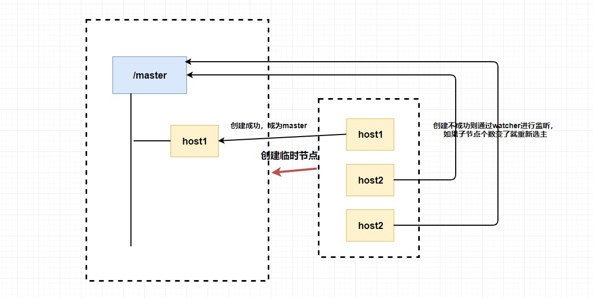
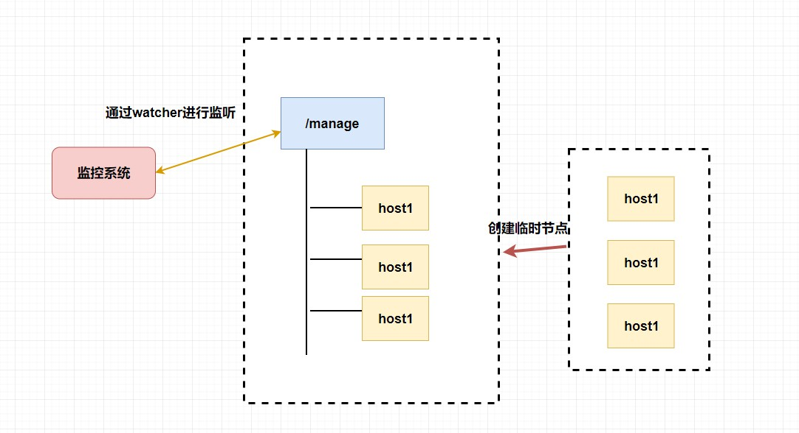
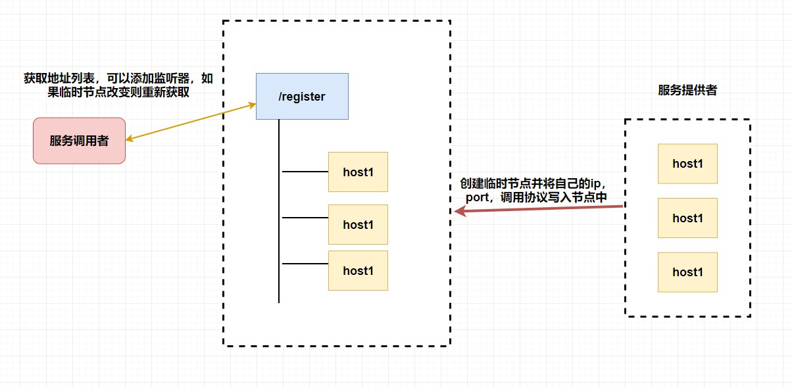

# ZooKeeper

### 什么是ZooKeeper
ZooKeeper 由 Yahoo 开发，后来捐赠给了 Apache ，现已成为 Apache 顶级项目。ZooKeeper 是一个开源的分布式应用程序协调服务器，其为分布式系统提供一致性服务。其一致性是通过基于 Paxos 算法的 ZAB 协议完成的。其主要功能包括：配置维护、分布式同步、集群管理、分布式事务等。

zookeeper

简单来说， ZooKeeper 是一个分布式协调服务框架。

有些同学并不是能把 **分布式和集群** 这两个概念很好的理解透。有同学可能认为分布式不就是加机器吗？一台机器不够用再加一台抗压呗。当然加机器这种说法也无可厚非，你一个分布式系统必定涉及到多个机器，但是你别忘了，计算机学科中还有一个相似的概念——Cluster ，集群不也是加机器吗？但是 集群 和 分布式 其实就是两个完全不同的概念。

比如，我现在有一个秒杀服务，并发量太大单机系统承受不住，那我加几台服务器也一样提供秒杀服务，这个时候就是 Cluster集群。

#### Cluster图示：


但是，我现在换一种方式，我将一个秒杀服务拆分成多个子服务 ，比如创建订单服务，增加积分服务，扣优惠券服务等等，然后我将这些子服务都部署在不同的服务器上 ，这个时候就是 **Distributed 分布式** 。

#### distributed图示：


而为什么分布式不是简单的加机器呢？因为我认为加机器更加适用于构建集群，因为它真是只有加机器。而对于分布式来说，你首先需要将业务进行拆分，然后再加机器（不仅仅是加机器那么简单），同时你还要去解决分布式带来的一系列问题。

比如各个分布式组件如何协调起来，如何减少各个系统之间的耦合度，分布式事务的处理，如何去配置整个分布式系统等等。ZooKeeper 主要就是解决这些问题的。

## 一致性问题
设计一个分布式系统必定会遇到一个问题—— 因为**分区容忍性（partition tolerance）的存在，就必定要求我们需要在系统可用性（availability）和数据一致性（consistency）中做出权衡**。这就是著名的 CAP 定理。

理解起来其实很简单，比如说把一个班级作为整个系统，而学生是系统中的一个个独立的子系统。这个时候班里的小红小明偷偷谈恋爱被班里的大嘴巴小花发现了，小花欣喜若狂告诉了周围的人，然后小红小明谈恋爱的消息在班级里传播起来了。当在消息的传播（散布）过程中，你抓到一个同学问他们的情况，如果回答你不知道，那么说明整个班级系统出现了数据不一致的问题（因为小花已经知道这个消息了）。而如果他直接不回答你，因为整个班级有消息在进行传播（为了保证一致性，需要所有人都知道才可提供服务），这个时候就出现了系统的可用性问题。

而上述前者就是 Eureka 的处理方式，它保证了AP（可用性），后者就是我们今天所要将的 ZooKeeper 的处理方式，它保证了CP（数据一致性）。

### 一致性协议和算法简介
而为了解决数据一致性问题，在科学家和程序员的不断探索中，就出现了很多的一致性协议和算法。比如 2PC（两阶段提交），3PC（三阶段提交），Paxos算法等等。

这时候请你思考一个问题，同学之间如果采用传纸条的方式去传播消息，那么就会出现一个问题——我咋知道我的小纸条有没有传到我想要传递的那个人手中呢？万一被哪个小家伙给劫持篡改了呢，对吧？

这个时候就引申出一个概念—— 拜占庭将军问题 。它意指 在不可靠信道上试图通过消息传递的方式达到一致性是不可能的， 所以所有的一致性算法的必要前提就是安全可靠的消息通道。

而为什么要去解决数据一致性的问题？你想想，如果一个秒杀系统将服务拆分成了下订单和加积分服务，这两个服务部署在不同的机器上了，万一在消息的传播过程中积分系统宕机了，总不能你这边下了订单却没加积分吧？你总得保证两边的数据需要一致吧？


## 引出 ZAB
### Zookeeper 架构
作为一个优秀高效且可靠的分布式协调框架，ZooKeeper 在解决分布式数据一致性问题时并没有直接使用 Paxos ，而是专门定制了一致性协议叫做 ZAB(ZooKeeper Automic Broadcast) 原子广播协议，该协议能够很好地支持 崩溃恢复 。

Zookeeper架构


### ZAB 中的三个角色
在介绍 ZAB 协议之前，我们首先来了解一下在 ZAB 中三个主要的角色，Leader 领导者、Follower跟随者、Observer观察者 。

- Leader ：集群中唯一的写请求处理者 ，能够发起投票（投票也是为了进行写请求）。
- Follower：能够接收客户端的请求，如果是读请求则可以自己处理，如果是写请求则要转发给 Leader 。在选举过程中会参与投票，有选举权和被选举权 。
- Observer ：就是没有选举权和被选举权的 Follower 。
在 ZAB 协议中对 zkServer(即上面我们说的三个角色的总称) 还有两种模式的定义，分别是 消息广播 和 崩溃恢复 。

### 消息广播模式
说白了就是 ZAB 协议是如何处理写请求的，上面我们不是说只有 Leader 能处理写请求嘛？那么我们的 Follower 和 Observer 是不是也需要同步更新数据 呢？总不能数据只在 Leader 中更新了，其他角色都没有得到更新吧？

不就是 在整个集群中保持数据的一致性嘛？如果是你，你会怎么做呢？

废话，**第一步** 肯定需要 Leader 将写请求 广播 出去呀，让 Leader 问问 Followers 是否同意更新，如果超过半数以上的同意那么就进行 Follower 和 Observer 的更新。画张图理解一下。

#### 消息广播


嗯。。。看起来很简单，貌似懂了🤥🤥🤥。这两个 Queue 哪冒出来的？答案是 ZAB 需要让 Follower 和 Observer 保证顺序性 。何为顺序性，比如我现在有一个写请求A，此时 Leader 将请求A广播出去，因为只需要半数同意就行，所以可能这个时候有一个 Follower F1因为网络原因没有收到，而 Leader 又广播了一个请求B，因为网络原因，F1竟然先收到了请求B然后才收到了请求A，这个时候请求处理的顺序不同就会导致数据的不同，从而 产生数据不一致问题。

所以在 Leader 这端，它为每个其他的 zkServer 准备了一个队列 ，采用先进先出的方式发送消息。由于协议是 *通过 TCP *来进行网络通信的，保证了消息的发送顺序性，接受顺序性也得到了保证。

除此之外，在 ZAB 中还定义了一个全局单调递增的事务ID ZXID ，它是一个64位long型，其中高32位表示 epoch 年代，低32位表示事务id。epoch 是会根据 Leader 的变化而变化的，当一个 Leader 挂了，新的 Leader 上位的时候，年代（epoch）就变了。而低32位可以简单理解为递增的事务id。

定义这个的原因也是为了顺序性，每个 proposal 在 Leader 中生成后需要 通过其 ZXID 来进行排序，才能得到处理。

### 崩溃恢复模式
说到崩溃恢复我们首先要提到 ZAB 中的 Leader 选举算法，当系统出现崩溃影响最大应该是 Leader 的崩溃，因为我们只有一个 Leader ，所以当 Leader 出现问题的时候我们势必需要重新选举 Leader 。

Leader 选举可以分为两个不同的阶段，第一个是我们提到的 Leader 宕机需要重新选举，第二则是当 Zookeeper 启动时需要进行系统的 Leader 初始化选举。下面我先来介绍一下 ZAB 是如何进行初始化选举的。

假设我们集群中有3台机器，那也就意味着我们需要两台以上同意（超过半数）。比如这个时候我们启动了 server1 ，它会首先 投票给自己 ，投票内容为服务器的 myid 和 ZXID ，因为初始化所以 ZXID 都为0，此时 server1 发出的投票为 (1,0)。但此时 server1 的投票仅为1，所以不能作为 Leader ，此时还在选举阶段所以整个集群处于 Looking 状态。

接着 server2 启动了，它首先也会将投票选给自己(2,0)，并将投票信息广播出去（server1也会，只是它那时没有其他的服务器了），server1 在收到 server2 的投票信息后会将投票信息与自己的作比较。首先它会比较 ZXID ，ZXID 大的优先为 Leader，如果相同则比较 myid，myid 大的优先作为 Leader。所以此时server1 发现 server2 更适合做 Leader，它就会将自己的投票信息更改为(2,0)然后再广播出去，之后server2 收到之后发现和自己的一样无需做更改，并且自己的投票已经超过半数 ，则确定 server2 为 Leader，server1 也会将自己服务器设置为 Following 变为 Follower。整个服务器就从 Looking 变为了正常状态。

当 server3 启动发现集群没有处于 Looking 状态时，它会直接以 Follower 的身份加入集群。

还是前面三个 server 的例子，如果在整个集群运行的过程中 server2 挂了，那么整个集群会如何重新选举 Leader 呢？其实和初始化选举差不多。

首先毫无疑问的是剩下的两个 Follower 会将自己的状态 从 Following 变为 Looking 状态 ，然后每个 server 会向初始化投票一样首先给自己投票（这不过这里的 zxid 可能不是0了，这里为了方便随便取个数字）。

假设 server1 给自己投票为(1,99)，然后广播给其他 server，server3 首先也会给自己投票(3,95)，然后也广播给其他 server。server1 和 server3 此时会收到彼此的投票信息，和一开始选举一样，他们也会比较自己的投票和收到的投票（zxid 大的优先，如果相同那么就 myid 大的优先）。这个时候 server1 收到了 server3 的投票发现没自己的合适故不变，server3 收到 server1 的投票结果后发现比自己的合适于是更改投票为(1,99)然后广播出去，最后 server1 收到了发现自己的投票已经超过半数就把自己设为 Leader，server3 也随之变为 Follower。

**请注意** ZooKeeper 为什么要设置奇数个结点？比如这里我们是三个，挂了一个我们还能正常工作，挂了两个我们就不能正常工作了（已经没有超过半数的节点数了，所以无法进行投票等操作了）。而假设我们现在有四个，挂了一个也能工作，但是挂了两个也不能正常工作了，这是和三个一样的，而三个比四个还少一个，带来的效益是一样的，所以 Zookeeper 推荐奇数个 server 。

那么说完了 ZAB 中的 Leader 选举方式之后我们再来了解一下 **崩溃恢复** 是什么玩意？

其实主要就是 当集群中有机器挂了，我们整个集群如何保证数据一致性？

如果只是 Follower 挂了，而且挂的没超过半数的时候，因为我们一开始讲了在 Leader 中会维护队列，所以不用担心后面的数据没接收到导致数据不一致性。

如果 Leader 挂了那就麻烦了，我们肯定需要先暂停服务变为 Looking 状态然后进行 Leader 的重新选举（上面我讲过了），但这个就要分为两种情况了，分别是 确保已经被Leader提交的提案最终能够被所有的Follower提交 和 跳过那些已经被丢弃的提案。

确保已经被Leader提交的提案最终能够被所有的Follower提交是什么意思呢？

假设 Leader (server2) 发送 commit 请求（忘了请看上面的消息广播模式），他发送给了 server3，然后要发给 server1 的时候突然挂了。这个时候重新选举的时候我们如果把 server1 作为 Leader 的话，那么肯定会产生数据不一致性，因为 server3 肯定会提交刚刚 server2 发送的 commit 请求的提案，而 server1 根本没收到所以会丢弃。

#### 崩溃恢复


那怎么解决呢？

聪明的同学肯定会质疑，这个时候 server1 已经不可能成为 Leader 了，因为 server1 和 server3 进行投票选举的时候会比较 ZXID ，而此时 server3 的 ZXID 肯定比 server1 的大了。(不理解可以看前面的选举算法)

那么跳过那些已经被丢弃的提案又是什么意思呢？

假设 Leader (server2) 此时同意了提案N1，自身提交了这个事务并且要发送给所有 Follower 要 commit 的请求，却在这个时候挂了，此时肯定要重新进行 Leader 的选举，比如说此时选 server1 为 Leader （这无所谓）。但是过了一会，这个 挂掉的 Leader 又重新恢复了 ，此时它肯定会作为 Follower 的身份进入集群中，需要注意的是刚刚 server2 已经同意提交了提案N1，但其他 server 并没有收到它的 commit 信息，所以其他 server 不可能再提交这个提案N1了，这样就会出现数据不一致性问题了，所以该提案N1最终需要被抛弃掉 。

#### 崩溃恢复


## Zookeeper的几个理论知识
了解了 ZAB 协议还不够，它仅仅是 Zookeeper 内部实现的一种方式，而我们如何通过 Zookeeper 去做一些典型的应用场景呢？比如说集群管理，分布式锁，Master 选举等等。

这就涉及到如何使用 Zookeeper 了，但在使用之前我们还需要掌握几个概念。比如 **Zookeeper 的 数据模型 、会话机制、ACL、Watcher机制**  等等。

### 数据模型
zookeeper 数据存储结构与标准的 Unix 文件系统非常相似，都是在根节点下挂很多子节点(树型)。但是 zookeeper 中没有文件系统中目录与文件的概念，而是 使用了 znode 作为数据节点 。znode 是 zookeeper 中的最小数据单元，每个 znode 上都可以保存数据，同时还可以挂载子节点，形成一个树形化命名空间。

#### zk数据模型


每个 znode 都有自己所属的 **节点类型** 和 **节点状态**。

其中节点类型可以分为 **持久节点、持久顺序节点、临时节点 和 临时顺序节点**。

- 持久节点：一旦创建就一直存在，直到将其删除。
- 持久顺序节点：一个父节点可以为其子节点 维护一个创建的先后顺序 ，这个顺序体现在 节点名称 上，是节点名称后自动添加一个由 10 位数字组成的数字串，从 0 开始计数。
- 临时节点：临时节点的生命周期是与 客户端会话 绑定的，会话消失则节点消失 。临时节点 只能做叶子节点 ，不能创建子节点。
- 临时顺序节点：父节点可以创建一个维持了顺序的临时节点(和前面的持久顺序性节点一样)。
  
节点状态中包含了很多节点的属性比如 czxid 、mzxid 等等，在 zookeeper 中是使用 Stat 这个类来维护的。下面我列举一些属性解释。

- czxid：Created ZXID，该数据节点被 创建 时的事务ID。
- mzxid：Modified ZXID，节点 最后一次被更新时 的事务ID。
- ctime：Created Time，该节点被创建的时间。
- mtime： Modified Time，该节点最后一次被修改的时间。
- version：节点的版本号。
- cversion：子节点 的版本号。
- aversion：节点的 ACL 版本号。
- ephemeralOwner：创建该节点的会话的 sessionID ，如果该节点为持久节点，该值为0。
- dataLength：节点数据内容的长度。
- numChildre：该节点的子节点个数，如果为临时节点为0。
- pzxid：该节点子节点列表最后一次被修改时的事务ID，注意是子节点的 列表 ，不是内容。

### 会话
我想这个对于后端开发的朋友肯定不陌生，不就是 session 吗？只不过 zk 客户端和服务端是通过 **TCP 长连接** 维持的会话机制，其实对于会话来说你可以理解为 **保持连接状态** 。

在 zookeeper 中，会话还有对应的事件，比如 CONNECTION_LOSS 连接丢失事件 、SESSION_MOVED 会话转移事件 、SESSION_EXPIRED 会话超时失效事件 。

### ACL
ACL 为 Access Control Lists ，它是一种权限控制。在 zookeeper 中定义了5种权限，它们分别为：

- CREATE ：创建子节点的权限。
- READ：获取节点数据和子节点列表的权限。
- WRITE：更新节点数据的权限。
- DELETE：删除子节点的权限。
- ADMIN：设置节点 ACL 的权限。

### Watcher机制
Watcher 为事件监听器，是 zk 非常重要的一个特性，很多功能都依赖于它，它有点类似于订阅的方式，即客户端向服务端 注册 指定的 watcher ，当服务端符合了 watcher 的某些事件或要求则会 向客户端发送事件通知 ，客户端收到通知后找到自己定义的 Watcher 然后 执行相应的回调方法 。

#### watcher机制


## Zookeeper的几个典型应用场景
前面说了这么多的理论知识，你可能听得一头雾水，这些玩意有啥用？能干啥事？别急，听我慢慢道来。


### 选主
还记得上面我们的所说的临时节点吗？因为 Zookeeper 的强一致性，能够很好地在保证 **在高并发的情况下保证节点创建的全局唯一性 (即无法重复创建同样的节点)**。

利用这个特性，我们可以 **让多个客户端创建一个指定的节点** ，创建成功的就是 master。

但是，如果这个 master 挂了怎么办？？？

你想想为什么我们要创建临时节点？还记得临时节点的生命周期吗？master 挂了是不是代表会话断了？会话断了是不是意味着这个节点没了？还记得 watcher 吗？我们是不是可以 让其他不是 master 的节点监听节点的状态 ，比如说我们监听这个临时节点的父节点，如果子节点个数变了就代表 master 挂了，这个时候我们 触发回调函数进行重新选举 ，或者我们直接监听节点的状态，我们可以通过节点是否已经失去连接来判断 master 是否挂了等等。

#### 选主


总的来说，我们可以完全 **利用 临时节点、节点状态 和 watcher 来实现选主的功能**，临时节点主要用来选举，节点状态和watcher 可以用来判断 master 的活性和进行重新选举。

### 分布式锁
分布式锁的实现方式有很多种，比如 Redis 、数据库 、zookeeper 等。个人认为 zookeeper 在实现分布式锁这方面是非常非常简单的。

上面我们已经提到过了 **zk在高并发的情况下保证节点创建的全局唯一性**，这玩意一看就知道能干啥了。实现互斥锁呗，又因为能在分布式的情况下，所以能实现分布式锁呗。

如何实现呢？这玩意其实跟选主基本一样，我们也可以利用临时节点的创建来实现。

首先肯定是如何获取锁，因为创建节点的唯一性，我们可以让多个客户端同时创建一个临时节点，创建成功的就说明获取到了锁 。然后没有获取到锁的客户端也像上面选主的非主节点创建一个 watcher 进行节点状态的监听，如果这个互斥锁被释放了（可能获取锁的客户端宕机了，或者那个客户端主动释放了锁）可以调用回调函数重新获得锁。

```
zk 中不需要向 redis 那样考虑锁得不到释放的问题了，因为当客户端挂了，节点也挂了，锁也释放了。
```

那能不能使用 zookeeper 同时实现 共享锁和独占锁 呢？答案是可以的，不过稍微有点复杂而已。

还记得 有序的节点 吗？

这个时候我规定所有创建节点必须有序，当你是读请求（要获取共享锁）的话，如果 没有比自己更小的节点，或比自己小的节点都是读请求 ，则可以获取到读锁，然后就可以开始读了。若比自己小的节点中有写请求 ，则当前客户端无法获取到读锁，只能等待前面的写请求完成。

如果你是写请求（获取独占锁），若 没有比自己更小的节点 ，则表示当前客户端可以直接获取到写锁，对数据进行修改。若发现 有比自己更小的节点，无论是读操作还是写操作，当前客户端都无法获取到写锁 ，等待所有前面的操作完成。

这就很好地同时实现了共享锁和独占锁，当然还有优化的地方，比如当一个锁得到释放它会通知所有等待的客户端从而造成 羊群效应 。此时你可以通过让等待的节点只监听他们前面的节点。

具体怎么做呢？其实也很简单，你可以让 读请求监听比自己小的最后一个写请求节点，写请求只监听比自己小的最后一个节点 ，感兴趣的小伙伴可以自己去研究一下。

### 命名服务
如何给一个对象设置ID，大家可能都会想到 UUID，但是 UUID 最大的问题就在于它太长了。。。(太长不一定是好事，嘿嘿嘿)。那么在条件允许的情况下，我们能不能使用 zookeeper 来实现呢？

我们之前提到过 zookeeper 是通过 树形结构 来存储数据节点的，那也就是说，对于每个节点的 全路径，它必定是唯一的，我们可以使用节点的全路径作为命名方式了。而且更重要的是，路径是我们可以自己定义的，这对于我们对有些有语意的对象的ID设置可以更加便于理解。

### 集群管理和注册中心
看到这里是不是觉得 zookeeper 实在是太强大了，它怎么能这么能干！

别急，它能干的事情还很多呢。可能我们会有这样的需求，我们需要了解整个集群中有多少机器在工作，我们想对集群的每台机器的运行时状态进行数据采集，对集群中机器进行上下线操作等等。

而 zookeeper 天然支持的 watcher 和 临时节点能很好的实现这些需求。我们可以为每条机器创建临时节点，并监控其父节点，如果子节点列表有变动（我们可能创建删除了临时节点），那么我们可以使用在其父节点绑定的 watcher 进行状态监控和回调。

#### 集群管理


至于注册中心也很简单，我们同样也是让 **服务提供者** 在 zookeeper 中创建一个临时节点并且将自己的 ip、port、调用方式 写入节点，当 服务消费者 需要进行调用的时候会 通过注册中心找到相应的服务的地址列表(IP端口什么的) ，并缓存到本地(方便以后调用)，当消费者调用服务时，不会再去请求注册中心，而是直接通过负载均衡算法从地址列表中取一个服务提供者的服务器调用服务。

当服务提供者的某台服务器宕机或下线时，相应的地址会从服务提供者地址列表中移除。同时，注册中心会将新的服务地址列表发送给服务消费者的机器并缓存在消费者本机（当然你可以让消费者进行节点监听，我记得 Eureka 会先试错，然后再更新）。

#### 注册中心


## 总结

这篇文章中我带大家入门了 zookeeper 这个强大的分布式协调框架。现在我们来简单梳理一下整篇文章的内容。

- 分布式与集群的区别

- zookeeper 专门的一致性算法 ZAB 原子广播协议的内容（Leader 选举、崩溃恢复、消息广播）。

- zookeeper 中的一些基本概念，比如 ACL，数据节点，会话，watcher机制等等。

- zookeeper 的典型应用场景，比如选主，注册中心等等。