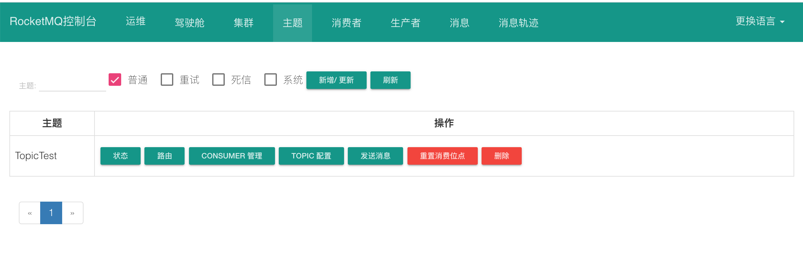
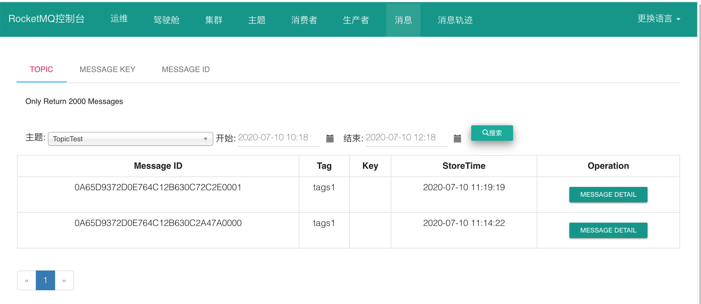

RcoketMQ 是一款低延迟、高可靠、可伸缩、易于使用的消息中间件。

具有以下特性：
- 支持发布/订阅（Pub/Sub）和点对点（P2P）消息模型
- 能够保证严格的消息顺序，在一个队列中可靠的先进先出（FIFO）和严格的顺序传递
- 提供丰富的消息拉取模式，支持拉（pull）和推（push）两种消息模式
- 单一队列百万消息的堆积能力，亿级消息堆积能力
- 支持多种消息协议，如 JMS、MQTT 等
- 分布式高可用的部署架构,满足至少一次消息传递语义

详细的 RcoketMQ 


## RocketMQ环境安装

RocketMQ环境安装，包括控制台，参考我的这一篇文章

[RocketMQ 安装](2020-03-24-rocketmq-install.md)


## SpringBoot 环境中使用 RocketMQ

### 在项目工程中导入 apache 的  rocketmq-client:

```
<!-- https://mvnrepository.com/artifact/org.apache.rocketmq/rocketmq-client -->
<dependency>
    <groupId>org.apache.rocketmq</groupId>
    <artifactId>rocketmq-client</artifactId>
    <version>4.7.1</version>
</dependency>
```


### 创建 RocketMQProperties 配置属性类，内容如下:

```
import lombok.Getter;
import lombok.Setter;
import org.springframework.boot.context.properties.ConfigurationProperties;

@ConfigurationProperties(prefix = "rocketmq")
@Getter
@Setter
public class RocketMQProperties {
    private boolean isEnable = false;
    private String namesrvAddr = "localhost:9876";
    private String groupName = "default";
    private int producerMaxMessageSize = 1024;
    private int producerSendMsgTimeout = 2000;
    private int producerRetryTimesWhenSendFailed = 2;
    private int consumerConsumeThreadMin = 5;
    private int consumerConsumeThreadMax = 30;
    private int consumerConsumeMessageBatchMaxSize = 1;
}
```

主要介绍下里面的几个属性：
- isEnable 是否开启mq
- namesrvAddr 集群地址
- groupName 分组名称

如有其它需求在这个的基础上进行扩展即可，类中我们已经给了默认值，也可以在配置文件或配置中心中获取配置，配置如下:

```
# 系统端口号
server.port=8090
#发送同一类消息的设置为同一个group，保证唯一,默认不需要设置，rocketmq会使用ip@pid(pid代表jvm名字)作为唯一标示
rocketmq.groupName=springboot-rocket-demo
#是否开启自动配置
rocketmq.isEnable=true
#mq的nameserver地址
rocketmq.namesrvAddr=10.211.55.5:9876
#消息最大长度 默认1024*4(4M)
rocketmq.producer.maxMessageSize=4096
#发送消息超时时间,默认3000
rocketmq.producer.sendMsgTimeout=3000
#发送消息失败重试次数，默认2
rocketmq.producer.retryTimesWhenSendFailed=2
#消费者线程数量
rocketmq.consumer.consumeThreadMin=5
rocketmq.consumer.consumeThreadMax=32
#设置一次消费消息的条数，默认为1条
rocketmq.consumer.consumeMessageBatchMaxSize=1
```

### 消费者相关创建与注册

#### 创建消费者接口 RocketConsumer.java 

该接口用来约束消费者需要的核心步骤:
- 项目启动的时候，初始化消费者
- 注册监听


```
import org.apache.rocketmq.client.consumer.listener.MessageListener;
import org.apache.rocketmq.client.consumer.listener.MessageListenerConcurrently;

/**
 * 消费者接口
 */
public interface RocketConsumer {

    /**
     * 初始化消费者
     */
    public abstract void init();

    /**
     * 注册监听
     *
     * @param messageListener
     */
    public void registerMessageListener(MessageListenerConcurrently messageListener);

}
```

#### 创建抽象消费者 AbstractRocketConsumer.java

实现 RocketConsumer，我们创建 抽象消费者。

这个抽象的消费者，提供两个功能，我们必须指定 topics, tags 与 消息监听逻辑：
- 初始化的时候，需要保存一些基本的必要信息
- 注册监听

在类中，public abstract void init(); 该方法是用于初始化消费者，由子类实现。

```
/**
 * 消费者基本信息
 *
 * */
@Setter
@Getter
public abstract class AbstractRocketConsumer implements RocketConsumer {

    protected String topics;
    protected String tags;
    protected MessageListenerConcurrently messageListener;
    protected String consumerTitle;
    protected MQPushConsumer mqPushConsumer;

    /**
     * 必要的信息
     *
     * @param topics
     * @param tags
     * @param consumerTitle
     */
    public void necessary(String topics, String tags, String consumerTitle) {
        this.topics = topics;
        this.tags = tags;
        this.consumerTitle = consumerTitle;
    }

    public abstract void init();

    @Override
    public void registerMessageListener(MessageListenerConcurrently messageListener) {
        this.messageListener = messageListener;
    }

}
```

### 创建自动配置类 RocketMQConfiguation.java

接下来我们编写自动配置类 RocketMQConfiguation.java, **该类用户初始化一个默认的生产者连接，以及加载所有的消费者。**

```
@Configuration  #标注为配置类
@EnableConfigurationProperties({ RocketMQProperties.class })  #使用该配置文件
@ConditionalOnProperty(prefix = "rocketmq", value = "isEnable", havingValue = "true") # 只有当配置中指定rocketmq.isEnable = true的时候才会生效
```

核心内容如下，主要提供了一下几个功能：
- 注入一个默认的消息生产者
- SpringBoot 启动时加载所有消费者

```
import com.piter.springbootrocketmq.consumer.AbstractRocketConsumer;
import lombok.extern.slf4j.Slf4j;
import org.apache.rocketmq.client.consumer.DefaultMQPushConsumer;
import org.apache.rocketmq.client.exception.MQClientException;
import org.apache.rocketmq.client.producer.DefaultMQProducer;
import org.springframework.boot.autoconfigure.condition.ConditionalOnProperty;
import org.springframework.boot.context.properties.EnableConfigurationProperties;
import org.springframework.context.ApplicationContext;
import org.springframework.context.annotation.Bean;
import org.springframework.context.annotation.Configuration;
import org.springframework.util.StringUtils;

import javax.annotation.PostConstruct;
import java.util.Iterator;
import java.util.Map;

/**
 * mq配置
 *
 */
@Slf4j
@Configuration
@EnableConfigurationProperties({ RocketMQProperties.class })
@ConditionalOnProperty(prefix = "rocketmq", value = "isEnable", havingValue = "true")
public class RocketMQConfiguation {

    private RocketMQProperties properties;

    private ApplicationContext applicationContext;


    public RocketMQConfiguation(RocketMQProperties properties, ApplicationContext applicationContext) {
        this.properties = properties;
        this.applicationContext = applicationContext;
    }

    /**
     * 注入一个默认的消息生产者
     * @return
     * @throws MQClientException
     */
    @Bean
    public DefaultMQProducer getRocketMQProducer() throws MQClientException {
        if (StringUtils.isEmpty(properties.getGroupName())) {
            throw new MQClientException(-1, "groupName is blank");
        }

        if (StringUtils.isEmpty(properties.getNamesrvAddr())) {
            throw new MQClientException(-1, "nameServerAddr is blank");
        }
        DefaultMQProducer producer;
        producer = new DefaultMQProducer(properties.getGroupName());

        producer.setNamesrvAddr(properties.getNamesrvAddr());
        // producer.setCreateTopicKey("AUTO_CREATE_TOPIC_KEY");

        // 如果需要同一个jvm中不同的producer往不同的mq集群发送消息，需要设置不同的instanceName
        // producer.setInstanceName(instanceName);
        producer.setMaxMessageSize(properties.getProducerMaxMessageSize());
        producer.setSendMsgTimeout(properties.getProducerSendMsgTimeout());
        // 如果发送消息失败，设置重试次数，默认为2次
        producer.setRetryTimesWhenSendFailed(properties.getProducerRetryTimesWhenSendFailed());

        try {
            producer.start();
            log.info("producer is start ! groupName:{},namesrvAddr:{}", properties.getGroupName(),
                    properties.getNamesrvAddr());
        } catch (MQClientException e) {
            log.error(String.format("producer is error {}", e.getMessage(), e));
            throw e;
        }
        return producer;

    }

    /**
     * SpringBoot启动时加载所有消费者
     */
    @PostConstruct
    public void initConsumer() {
        Map<String, AbstractRocketConsumer> consumers = applicationContext.getBeansOfType(AbstractRocketConsumer.class);
        if (consumers == null || consumers.size() == 0) {
            log.info("init rocket consumer 0");
        }
        Iterator<String> beans = consumers.keySet().iterator();
        while (beans.hasNext()) {
            String beanName = (String) beans.next();
            AbstractRocketConsumer consumer = consumers.get(beanName);
            consumer.init();
            createConsumer(consumer);
            log.info("init success consumer title {} , toips {} , tags {}", consumer.getConsumerTitle(), consumer.getTags(),
                    consumer.getTopics());
        }
    }

    /**
     * 通过消费者信息，创建消费者
     *
     * @param arc
     */
    public void createConsumer(AbstractRocketConsumer arc) {
        DefaultMQPushConsumer consumer = new DefaultMQPushConsumer(this.properties.getGroupName());
        consumer.setNamesrvAddr(this.properties.getNamesrvAddr());
        consumer.setConsumeThreadMin(this.properties.getConsumerConsumeThreadMin());
        consumer.setConsumeThreadMax(this.properties.getConsumerConsumeThreadMax());
        consumer.registerMessageListener(arc.getMessageListener());
        /**
         * 设置Consumer第一次启动是从队列头部开始消费还是队列尾部开始消费 如果非第一次启动，那么按照上次消费的位置继续消费
         */
        // consumer.setConsumeFromWhere(ConsumeFromWhere.CONSUME_FROM_FIRST_OFFSET);
        /**
         * 设置消费模型，集群还是广播，默认为集群
         */
        // consumer.setMessageModel(MessageModel.CLUSTERING);

        /**
         * 设置一次消费消息的条数，默认为1条
         */
        consumer.setConsumeMessageBatchMaxSize(this.properties.getConsumerConsumeMessageBatchMaxSize());
        try {
            consumer.subscribe(arc.getTopics(), arc.getTags());
            consumer.start();
            arc.setMqPushConsumer(consumer);
        } catch (MQClientException e) {
            log.error("info consumer title {}", arc.getConsumerTitle(), e);
        }

    }

}
```
其中 initConsumer() 通过我们的抽象类，获取所有必要信息对消费者进行创建，该步骤会在所有消费者初始化完成后进行，且只会管理 Spring Bean 的消费者。


然后在 src/main/resources 文件夹中创建目录与文件 META-INF/spring.factories 里面添加自动配置类即可开启启动配置，我们只需要导入依赖即可:

```
org.springframework.boot.autoconfigure.EnableAutoConfiguration=\
com.piter.springbootrocketmq.config.RocketMQConfiguation
```


### 创建默认的消费者 DefaultConsumerMQ.java

创建消费者的步骤非常简单，只需要继承 AbstractRocketConsumer, 然后再加上 Spring 的 @Component 就能够完成消费者的创建，我们可以在类中自定义消费的主题与标签。

在项目中，可以根据需求，当消费者创建失败的时候是否继续启动工程。

```
import org.apache.rocketmq.client.consumer.listener.ConsumeConcurrentlyContext;
import org.apache.rocketmq.client.consumer.listener.ConsumeConcurrentlyStatus;
import org.apache.rocketmq.client.consumer.listener.MessageListenerConcurrently;
import org.apache.rocketmq.common.message.MessageExt;
import org.springframework.stereotype.Component;

import java.util.List;

@Component
public class DefaultConsumerMQ extends AbstractRocketConsumer {
    /**
     * 初始化消费者
     */
    @Override
    public void init() {
        // 设置主题,标签与消费者标题
        super.necessary("TopicTest", "*", "这是标题");
        //消费者具体执行逻辑
        registerMessageListener(new MessageListenerConcurrently() {
            @Override
            public ConsumeConcurrentlyStatus consumeMessage(List<MessageExt> msgs, ConsumeConcurrentlyContext context) {
                msgs.forEach(msg -> {
                    System.out.printf("consumer message boyd %s %n", new String(msg.getBody()));
                });
                // 标记该消息已经被成功消费
                return ConsumeConcurrentlyStatus.CONSUME_SUCCESS;
            }
        });
    }
}
```

super.necessary("TopicTest", "*", "这是标题"); 是必须要设置的，代表该消费者监听 TopicTest 主题下所有 tags。

标题那个字段是自己定义的，对于该配置来说没什么意义。

我们可以在MessageListener这里，注入 Spring 的 Bean 来进行任意逻辑处理。


## 自测试

### 创建 controller 

```
@RestController
public class RocketMqTestController {

    @Autowired
    private DefaultMQProducer defaultMQProducer;

    @GetMapping(value = "sendmq")
    public String testMQProducer(String msg) throws UnsupportedEncodingException, InterruptedException, RemotingException, MQClientException, MQBrokerException {
        Message message = new Message("TopicTest", "tags1", msg.getBytes(RemotingHelper.DEFAULT_CHARSET));
        // 发送消息到一个Broker
        SendResult sendResult = defaultMQProducer.send(message);
        // 通过sendResult返回消息是否成功送达
        System.out.printf("%s%n", sendResult);
        return sendResult.toString();
    }

}
```

### 启动类

```
import org.springframework.boot.SpringApplication;
import org.springframework.boot.autoconfigure.SpringBootApplication;

@SpringBootApplication
public class SpringBootRocketmqApplication {

    public static void main(String[] args) {
        SpringApplication.run(SpringBootRocketmqApplication.class, args);
    }

}
```


### 启动项目，采用 postman 发起请求


```
2020-07-10 11:14:21.787  INFO 11534 --- [nio-8090-exec-1] o.a.c.c.C.[Tomcat].[localhost].[/]       : Initializing Spring DispatcherServlet 'dispatcherServlet'
2020-07-10 11:14:21.793  INFO 11534 --- [nio-8090-exec-1] o.s.web.servlet.DispatcherServlet        : Initializing Servlet 'dispatcherServlet'
2020-07-10 11:14:21.873  INFO 11534 --- [nio-8090-exec-1] o.s.web.servlet.DispatcherServlet        : Completed initialization in 56 ms
SendResult [sendStatus=SEND_OK, msgId=0A65D9372D0E764C12B630C2A47A0000, offsetMsgId=0AD3370500002A9F000000000003770B, messageQueue=MessageQueue [topic=TopicTest, brokerName=centos-linux.shared, queueId=2], queueOffset=250]
consumer message boyd 呵呵呵 
SendResult [sendStatus=SEND_OK, msgId=0A65D9372D0E764C12B630C72C2E0001, offsetMsgId=0AD3370500002A9F00000000000377CE, messageQueue=MessageQueue [topic=TopicTest, brokerName=centos-linux.shared, queueId=1], queueOffset=251]
consumer message boyd 呵呵呵 
```
可以看到，我们后台成功的实现了消息的消费。

### rocket mq 控制台查看相关信息

主题如下：




消费者成功注册：


消息成功发动并消费：




## 总结

关于 rocketMQ 的功能，还有一些其他的，比如 顺序消息生产，顺序消费消息，异步消息生产等等，大家可参照官方去自行研究下。

- ActiveMQ 没经过大规模吞吐量场景的验证，社区不活跃。
- RabbitMQ 集群动态扩展麻烦，elang语言，国内较难定制化。
- kafka    支持主要的 MQ 功能，存在消息丢失的可能性。
- rocketMQ MQ功能较为完善，分布式的，扩展性好；支持复杂MQ业务场景。


